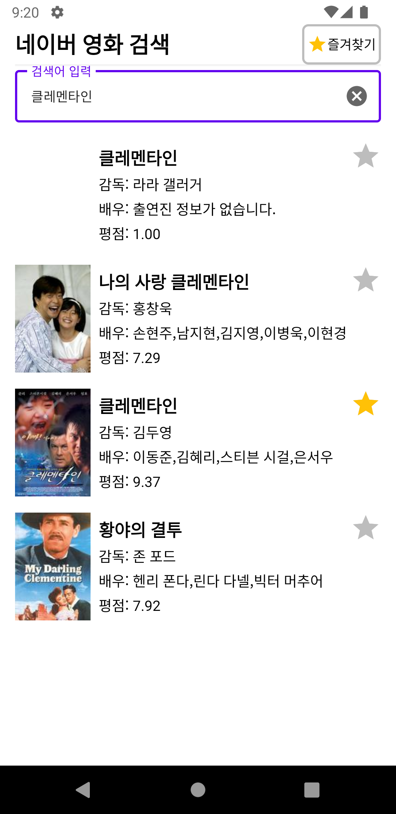
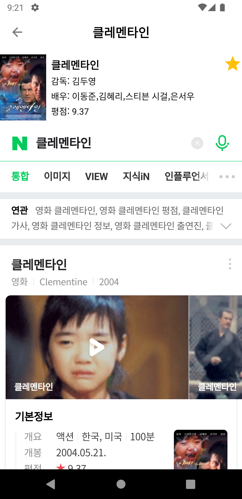

  

# **Naver Movie Android**
## **USED DATA FROM**
- [Naver Open API - Search](https://developers.naver.com/docs/serviceapi/search/movie/movie.md#%EC%98%81%ED%99%94)

## **Screen Shots**
  

## **Libraries & Skill**

- [LifeCycle-Extensions](https://developer.android.com/jetpack/androidx/releases/lifecycle?hl=ko)
- [DataBinding](https://developer.android.com/topic/libraries/data-binding)
- [ViewModel](https://developer.android.com/topic/libraries/architecture/viewmodel?hl=ko)
- [Room](https://developer.android.com/training/data-storage/room?hl=ko)
- [GSON](https://github.com/google/gson)
- [Glide](https://github.com/bumptech/glide)
- [Retrofit2](https://square.github.io/retrofit/)
- [OkHttp](https://square.github.io/okhttp/)
